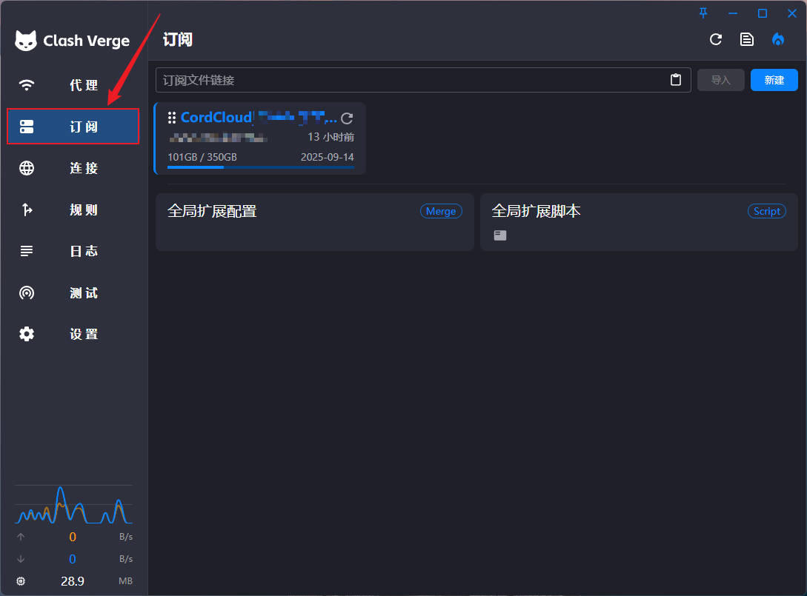
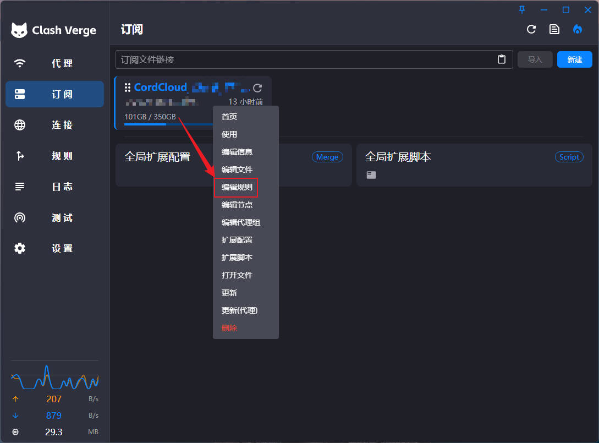
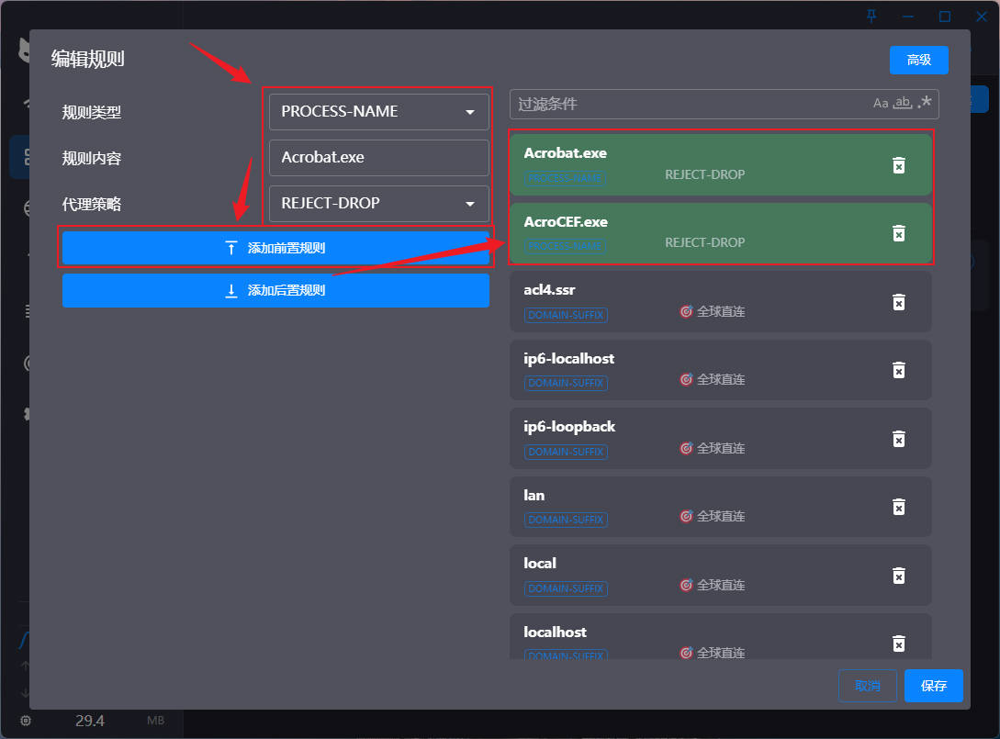

# 📕
------

### 1. 打开Clash Verge GUI

### 2. 切换到“订阅”选项卡

### 3. 右击订阅配置,左击“编辑规则”选项

### 4. 插入两条前置规则，规则详情如下：
> 规则类型：PROCESS-NAME  
> 规则内容一：Acrobat.exe  
> 规则内容二：AcroCEF.exe  
> 代理策略：REJECT-DROP  

### 5. 配置完成后，Adobe Acrobat Pro软件请求联网时，在Clash Verge的“日志”标签页可见到拦截日志

------
