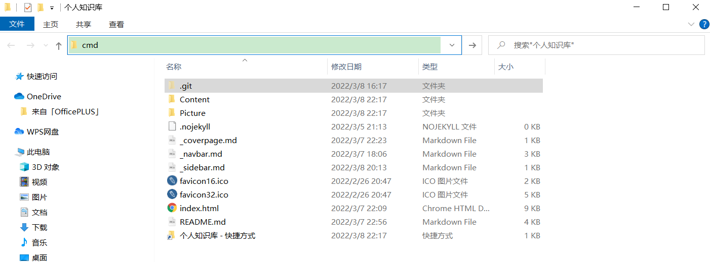

# **❤**

------


# **📕 写在最前**

<table><tr><td bgcolor=PowderBlue>" 搭建一个属于自己的个人知识库，顺带梳理一下自己的知识体系和学习路径，这样就会特别清晰。"</td></tr></table>

**🚩好了，开始阅读吧！**

------

# **🚀先看成果**

> [野生钢铁侠の知识库](https://mrli123456789.github.io/)

> [!NOTE]
>
> 来到我的知识库网站，想必大家已经看到封面的介绍了，从2022年3月6日建站开始，这个网站在一点点地丰富，也因为你的到来，让这个网站开始变得更有价值。**不忘初心，方得始终。**在这里，我将再一次声明**建站的初衷**：
>
> ***我想制作这样一个知识库网站：在这里，我会为每一个跟我一样，想成为野生钢铁侠，但不知从何下手的的大学生，提供技能树中每一项技能的详细学习的路线。如果这个网站能够给一些志同道合的人一点的帮助，就一切都值得了。***
>
> 好了，接下来将具体向你展示我当初从想法到建站的过程。

------

# **🚗学习路线**

> [!TIP]
> **第一步：发现痛点**

<!-- tabs -->

> [!NOTE]
>
> **痛点一：资料收集得太多太杂，急需整理。**
>
> - 是否你也跟我一样：`“收藏＝学会”`？常常各种资源、文章、博客，包括GitHub链接、PDF文档收藏了很多，但却基本不看？导致此的很大的一个原因，不是因为资料少，反而是因为`资料太多、太杂了`。`没有条理`，也`没有分类`、更`不好检索`，故而有时候你想查阅却不知道从何看起。我认为收集资料没有问题，但是强烈建议在入库的那一刻便做好`归类与标记`，这样就可以方面后续的检索和学习。**把资料用起来，这个才是关键。**
>
> **痛点二：在学习的过程中只顾着闷着头跑，而忽略了全局。**
>
> - 在我学习的过程中，常常会一头扎进某个知识点、或者某个问题，然后就吭哧吭哧出不来，导致后来慢慢失去了当初的兴趣，最后被劝退。我认为要想避免这样的恶性循环，在学习的过程中最好要有一个全局的概念，也就是及时梳理自己的知识体系和学习路径。**知道自己身处在知识体系的位置，明确学习路径，才能更好的掌握知识。** 
>
> 而搭建**知识库网站**，正好可以应对这两个痛点。

<!-- tabs -->

> [!TIP]
> **第二步：本地部署**

> 打造一个免费的个人知识库，干净又卫生！

<iframe src="//player.bilibili.com/player.html?aid=508269542&bvid=BV1eu411m797&cid=488687458&page=1&as_wide=1&high_quality=1&danmaku=1" allowfullscreen="true" width="100%" height="450" scrolling="no" frameborder="0" sandbox="allow-top-navigation allow-same-origin allow-forms allow-scripts"></iframe>

> [!NOTE]
>
> 在部署的过程中，同Blog的搭建过程一样，我**也没有全部跟着教程的操作进行**。在视频的10：30左右，也就是成功打造网站之后，Up主介绍了很多部署的方案，同时视频演示的是云服务器的部署。在这里，我选择使用`GitHub Page`的方式：不需要购买云服务器，同时也省去了域名的购买。因为对于学生党来说，这一笔钱算得上是一点负担，同时在大多数情况下网站也只为自己使用，部署到GitHub就已足够。

> 视频中Up主所提到的MarkDown源文件：
>
> [百度网盘链接]( https://pan.baidu.com/s/1aUBS0ZlHic7mBG5xyYc0gw) 
>
> 提取码: z7hm

> [!TIP]
> **第三步：GitHub Page部署**

> [!NOTE]
>
> 相较于Blog的部署，知识库的部署要简单很多。
>
> - 创建一个新的 `repository`
>
>   在GitHub上创建一个`用户名.github.io`仓库
>
> - 推送本地仓库至远程
>
>   ```bash
>   git init //初始化仓库
>   git add . //添加所有文件进暂存区
>   git commit -a -m "my first commit" //提交文件到仓库 以备提交到远程
>   //当确定好自己所有的文件可以提交到远程时 执行下面的命令
>   git push -u origin master
>   ```
>
> - 设置 Github Page
>
>   点击仓库的`Setting`--`Page`,在 `Branch` 处选择 `master`，在次一个选项处，选择 `/doc`
>
>   选择完成之后，点击`save`，即可看到自己的网址了

> [!TIP]
> **第四步：配置参数、优化改造**

> CSDN:
>
> [docsify 构建文档网站之定制功能](https://blog.csdn.net/wugenqiang/article/details/107071378)
>
> Docsify官方文档:
>
> [Docsify](https://docsify.js.org/#/zh-cn/)

> [!TIP]
>
> **第五步：标准化上传流程**

> [!NOTE]
>
> **掌握了以上全部知识之后，就可以开始正式运营我们的知识库了。在这里，我向您介绍一下我本人每次上传知识库的流程，熟练掌握这些操作流程，就不用在羁绊在工具层次，就可以把更多的精力投入到编辑优质的内容当中。**

🚩**首先，你需要了解下面这个知识：**

> **多页文档**
>
> 如果需要创建多个页面，或者需要多级路由的网站，在 docsify 里也能很容易的实现。例如创建一个 `guide.md` 文件，那么对应的路由就是 `/#/guide`。
>
> 假设你的目录结构如下：
>
> ```text
> .
> └── docs
>     ├── README.md
>     ├── guide.md
>     └── zh-cn
>         ├── README.md
>         └── guide.md
> ```
>
> 那么对应的访问页面将是：
>
> ```text
> docs/README.md        => http://domain.com
> docs/guide.md         => http://domain.com/guide
> docs/zh-cn/README.md  => http://domain.com/zh-cn/
> docs/zh-cn/guide.md   => http://domain.com/zh-cn/guide
> ```

> [!NOTE]
>
> - 根目录下创建一个`Content`文件夹，在此文件夹中生成`md`文件并编辑，这样网站就可以承载多个`md`。不过，要想能够实现在导航栏选择切换不同的`md`，就需要配置`_sidebar.md`。具体配置如下：
>
>   
>
>   这样就可以在导航栏显示了。
>
>   （ 这里有一个小技巧：你可以在`根目录`下创建一个`Picture`文件夹，用来存放`md`文件中的图片，那样就不需要将图片上传至图床，也就解决了`“图传会不会过期”`、`“图床非会员功能限制怎么办”`等困扰。）
>
> - 编辑结束后，即可参照`第三步`，使用`bash`命令轻松部署。
>
>   （ 这里还有一个小技巧：在本地编辑的时候，可以输入`cmd`命令，打开 `http://localhost:3000` 端口，实时查看渲染结果。）
>
>   

------


# [**❓ 疑问汇总**](http://localhost:3000/#/Content/打造个人博客网站?id=❓-疑问汇总)

> **我的GitHub账户在搭建Blog时已经使用了怎么办？**

- 第一种方案：**使用Gitee Page部署**。

  Gitee有着和GitHub极其相似的操作逻辑与功能，且其友好的中文界面，对于国人来说更好操作。

  你可以将目标文件夹重新上传至Gitee仓库，我认为更快捷的方式是：先将文件夹`上传至GitHub`，然后使用`Gitee的克隆`功能，将GitHub仓库克隆到Gitee上，这样就可以实现**一次提交，多平台共享**。

- 第二种方案：**重新注册一个GitHub账户**。

  我对比了GitHub和Gitee，发现`Gitee`开启Page功能需要`实名认证`，相较而言，`GitHub`的注册只需一个邮箱账号，且Page功能可以`直接开放`，这对于小白练手很是友好。所以我认为第二种方案更加友好。

------

By : Redamancy785 | 2022/3/8